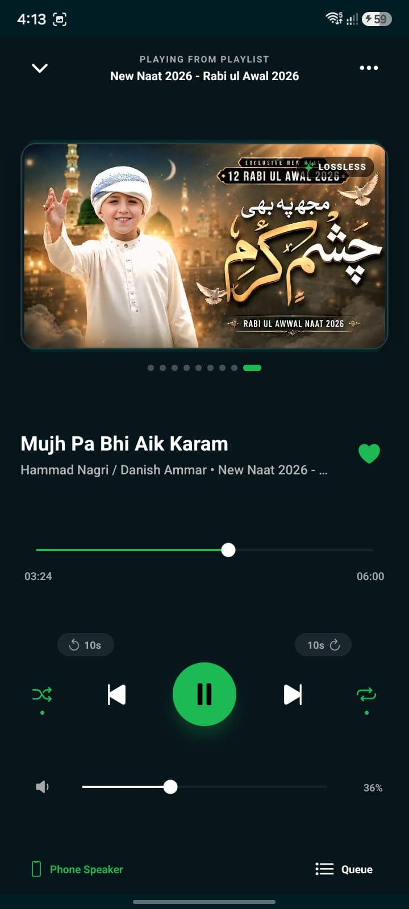
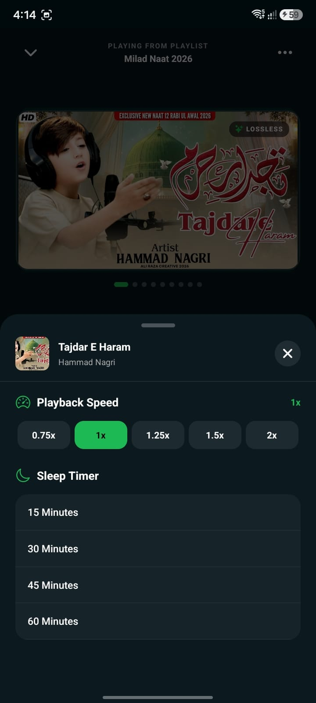

# 🎵 Spotify Musics App - React Native

A fully professional, premium, Spotify-tier music streaming player built with **React Native (v0.87)**, **React 19**, **TypeScript**, and **@rntp/player** (powered by Android Media3 / ExoPlayer).

---

## 📱 Screenshots

<div align="center">
  <table>
    <tr>
      <td align="center" width="33%">
        
        <br />
        <b>Player Screen</b>
      </td>
      <td align="center" width="33%">
        
        <br />
        <b>Queue & Playlist Drawer</b>
      </td>
      <td align="center" width="33%">
        
        <br />
        <b>Options & Controls</b>
      </td>
    </tr>
  </table>
</div>

---

## ✨ Features

### 🎨 1. Premium Spotify-Style UI & Widescreen Artwork
- **True 16:9 Widescreen Artwork**: Displays full album covers and video thumbnails edge-to-edge with `resizeMode="contain"` — zero cut-off, cropping, or distortion.
- **Ambient Glow Halo**: Dynamic colored backlight behind the album card for a deep, floating aesthetic.
- **Interactive Carousel & Pagination**: Smooth horizontal swipe between tracks with live animated pill pagination dots.
- **LOSSLESS Audio Pill**: High-fidelity indicator badge with icon.
- **Top Navigation Header**: Collapse button, uppercase playlist subtitle, and options trigger.

### ⚡ 2. Advanced Playback Engine
- **Hero Play / Pause Button**: Elevated vibrant green circular control (`#1DB954`) with integrated buffering activity indicator and touch scale feedback.
- **Shuffle Mode**: Instant shuffle toggle with Spotify green active dot indicator.
- **3-State Repeat Mode**: Cycles through **Off**, **Repeat All** (with active dot), and **Repeat One** (with a dedicated "1" badge).
- **10-Second Quick Seek**: Dedicated `-10s` rewind and `+10s` fast-forward pills.
- **Zero-Lag Track Switching**: Race-condition-free track transitions without re-buffering stutter or freezes.

### 🔊 3. Interactive Progress & Volume Controls
- **Scrubbable Progress Slider**: Smooth drag scrubbing state (`isSliding`) with tabular elapsed and remaining duration timestamps.
- **Dedicated Volume Bar**: 0% to 100% slider with dynamic icons (`volume-mute`, `volume-low`, `volume-high`) and instant tap-to-mute/restore.

### 📜 4. Slide-Up Queue / Playlist Drawer
- Quick-access bottom sheet listing all songs with:
  - Track indices
  - Artwork thumbnails
  - Song titles & artists
  - Active playing indicator with green soundwave icon
  - Direct tap-to-play selection

### ⚙️ 5. Options Menu (Playback Speed & Sleep Timer)
- **Variable Playback Speed**: Select between `0.75x`, `1.0x`, `1.25x`, `1.5x`, and `2.0x`.
- **Sleep Timer**: Auto-stops playback after `15m`, `30m`, `45m`, or `60m` with a gentle 3-second audio fade-out.
- **Active Track Card**: Overview card displaying active album art, title, and artist.
- **Favorite (Heart) System**: Single-tap toggle to like/save songs with Spotify green active styling.

---

## 🛠️ Tech Stack

| Technology | Purpose |
| :--- | :--- |
| **React Native (0.87.1)** | Core mobile framework with modern architecture |
| **React (19.2.3)** | Component architecture and state management |
| **TypeScript (6.x)** | Complete static type safety |
| **@rntp/player (5.9.2)** | Native audio playback engine (Android Media3 ExoPlayer) |
| **@react-native-community/slider** | Smooth interactive seeking and volume control |
| **@react-native-vector-icons/ionicons** | Clean, modern icons |
| **react-native-safe-area-context** | Full device safe-area handling |

---

## 📂 Project Structure

```text
SpotifyMusics-App-React-Native/
├── assets/                  # Project screenshots and branding
├── android/                 # Native Android configuration (Manifest, permissions)
├── src/
│   ├── assets/              # Local audio tracks (.mp3)
│   ├── components/
│   │   ├── ControlCenter.tsx # Play, Pause, Next, Prev, Shuffle, Repeat, 10s Seek
│   │   ├── Header.tsx        # Top navigation bar
│   │   ├── MusicInfo.tsx     # Title, artist, album, and Favorite (Heart) button
│   │   ├── MusicSlider.tsx   # Scrubbable song progress bar with timestamps
│   │   ├── OptionsMenu.tsx   # Speed controller and Sleep Timer modal
│   │   ├── QueueModal.tsx    # Slide-up playlist queue drawer
│   │   └── VolumeControl.tsx # Interactive volume slider with mute toggle
│   ├── screens/
│   │   └── MusicPlayer.tsx   # Main player screen assembling all components
│   ├── services/
│   │   ├── loadPlaylist.ts   # Safe queue verification & loading service
│   │   └── playerSetup.ts    # Resilient TrackPlayer initialization
│   ├── constants.ts         # Playlist metadata and audio assets
│   └── App.tsx              # Root component & safe area setup
├── index.js                 # App entry point & background playback registration
└── package.json
```

---

## 🚀 Getting Started

### Prerequisites
- **Node.js**: `>= 22.11.0`
- **Android Studio** with Android SDK (API 34+) and Android Emulator (or a physical device with USB debugging enabled).

### Installation & Run

1. **Clone the repository:**
   ```bash
   git clone https://github.com/imtiazaly/SpotifyMusics-App-React-Native.git
   cd SpotifyMusics-App-React-Native
   ```

2. **Install dependencies:**
   ```bash
   npm install
   ```

3. **Verify TypeScript compilation:**
   ```bash
   npx tsc --noEmit
   ```

4. **Start the Metro bundler:**
   ```bash
   npm start
   ```

5. **Run on Android:**
   ```bash
   npm run android
   ```

---

## 📄 License
This project is open-source and available under the [MIT License](LICENSE).
